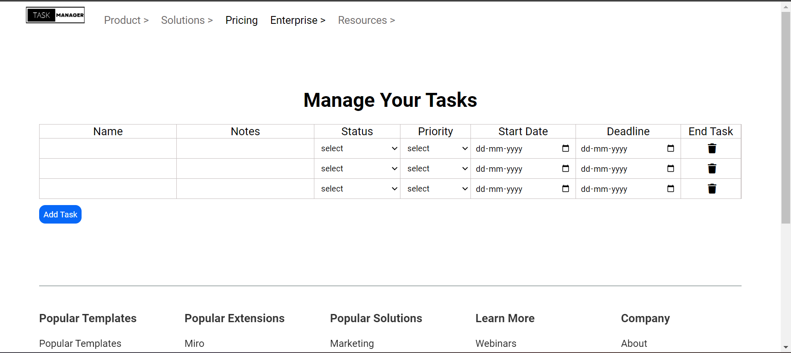

## Task Manager - Airtable Clone 
Airtable is a cloud collaboration service headquartered in San Francisco. It was founded in 2012 by Howie Liu, Andrew Ofstad, and Emmett Nicholas. Airtable is a spreadsheet-database hybrid, with the features of a database but applied to a spreadsheet

### Features
- Home Page
- Templates Page
- Taking Notes and assigning tasks to Other employees
- Login /Sign Up

### Tech Stack
- HTML5
- CSS 3
- Javascript
- Mock API for Server

### Pages
##### Home Page

#### SignIn Page

#### Login Page

#### Task Page
On this Page, the user can schedule his task and if the user is a lead he/she can assign it to the employees.

#### Templates Page

### Contributors
[Ram Saraf](https://github.com/ramsarraf11)

[Ashish Tripathy](https://github.com/malonicester)

[Naveen Kumar](https://github.com/naveen13A)

[Aditya Pradhan](https://github.com/adilovesmom)